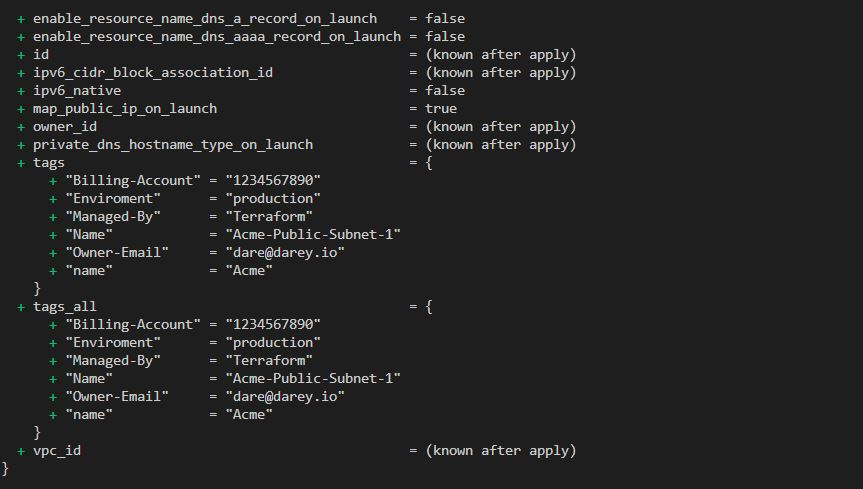

### AUTOMATE INFRASTRUCTURE WITH IAC USING TERRAFORM - CONTINUATION
---

# Set up tagging for our resources

In file variables .tf, I declared the variables tag and name

```
variable "name" {
type = string
default = "Acme"

}

variable "tags" {
  description = "A mapping of tags to assign to all resources."
  type        = map(string)
  default     = {}
}

```
Then in file terraform.tfvars, I set values for tags

```
tags = {
  name            = "Acme"
  Enviroment      = "production"
  Owner-Email     = "dare@darey.io"
  Managed-By      = "Terraform"
  Billing-Account = "1234567890"
}

```

In main.tf , I implemented tagging in the public subnets

```
# Create public subnets
resource "aws_subnet" "public" {
  count                   = var.preferred_number_of_public_subnets == null ? length(data.aws_availability_zones.available.names) : var.preferred_number_of_public_subnets
  vpc_id                  = aws_vpc.main.id
  cidr_block              = cidrsubnet(var.vpc_cidr, 8, count.index)
  map_public_ip_on_launch = true
  availability_zone       = data.aws_availability_zones.available.names[count.index]

tags = merge(
var.tags,
{
  Name = format("%s-Public-Subnet-%s", var.name, count.index)
},

)
}

```

  
